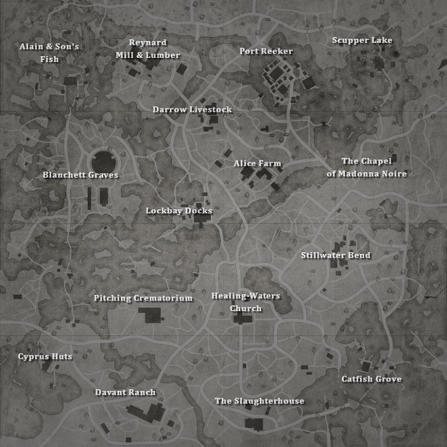

# Hunt Player Tracker

Web app to track player movement in Hunt Showdown.

## Context

For those unfamiliar with the game, Hunt Showdown is a competitive online game.
The goal of the game is for players to find and kill a boss on the map. After killing the boss a process can be started called Banishment. 
In this time players have to wait until the boss is banished after which they can pick up a bounty. 
The bounty must then be brought to an extraction point to win the game.

The map is split into compounds, the boss can be at any of these compounds. To find the boss players have to pick up clues at each compound.

After picking up a clue compounds get marked as excluded, indicating that the boss isn't there.
After picking up three clues the boss is revealed. Or if a player happends to find a boss compound by travelling there.

Players start at the edges of the map alone or in groups of two or three. 
Each match has a maximum of 12 players, so for groups of three there is a maximum of 4 groups.
When two groups encounter eachother there will be a gunfight, the winner can proceed to get the bounty and extract. 

Knowing where your opponents are or might be can play a huge role in winning Hunt Showdown. A well placed suprise attack can give players a huge advantage for example.
This is why this tool exists, it tries to help predicting/tracking where other players are.

## The Theory

Player movement is a hard thing to predict in Hunt. 
The initial 5-10 minutes is doable because we know that most player go to the nearest compound from their spawn point.

After that we can guess where other hunters are based on the sounds that they make (Gunshots/fights and banishments). And of course close range encounters. 

### Starting Point

First of all we start by defining the places other players can be and can go to, we use graph theory for this.

We see each compound as a vertex in a graph and the routes as edges.
At the start of a match we give the vertices with spawn points a weighing of the amount of spawnpoints. Compounds with no spawn points get a weighting of 0.
So Lockbay docks would receive a 0 on all edges while Blanchett Graves would receive 3.

We also weigh the edges to the amount of minutes it typically takes for a team to move from vertex A to vertex B.
Each edge can also be directional, initially no direction is given. 

If there are two bosses we can define which compounds belong to which boss. 
We can mark edges that change bosses as lower priority as it is likely that players stay in the same region. 

### Movement Between Vertices

The weight of each vertex is gradually passed over it's outgoing edges to the connected vertex. 

First of all we count the outgoing edges in the current area and the amount of edges going to the other area.
We want 80% to go to the current area and 20% to the other area, this ratio might change but the principle stays the same. We calculate the capacity for each area based on the outgoing edges for each area.
If there is only one area we just calculate this for one area.

Next we decide per edge what amount of weight to give away.

For each edge the capacity for it's area is divided by the edge weight which is shifted to the connected vertex.

For example:

We have a vertex with 5 outgoing edges, 1 is in other area. The weight of the vertex is 100. Each edge has a weight of 5
- Area 1 gets 80%, 100 * 0,8 = 80
- Area 2 gets 20%, 100 * 0,2 = 20

Then calculate the weight per edge to give away.
- Area 1
    - Edge 1: 80 / 5 = 16
    - Edge 2: 80 / 5 = 16
    - Edge 3: 80 / 5 = 16
    - Edge 4: 80 / 5 = 16
- Area 2
    - Edge 1: 20 / 5 = 4
    
    

### Excluding Vertices

When picking up clues certain compounds are excluded so we have to mark those vertices as excluded.
When a vertex is excluded all it's edges get an outgoing direction.

### Additional Tracking
To further the accuracy of our prediction we as a player can listen for events that happen during a match.
For example, if we hear a gunshot at a certain compound we can be certain that at that point in time there are players there.

#### Gunshot

When a gunshot is heard on a certain compound we can increase the weight of that compound.
This will ensure that the vertex weights in that part of the map are higher. 

#### Fights

When there is a fight at a certain compound we do the same as the gunshot but double. 
We also increase the weights of the outgoing edges for a short while because players tend to stay longer at a compound for the gunfight / looting. 

#### Banishments

When there is a banishment all compounds in that area are excluded.
